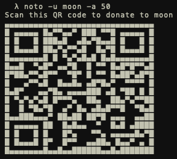
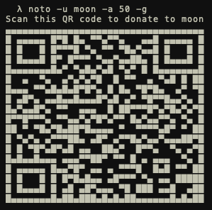

# noto
A simple CLI to generate a QR code from the terminal using the https://nano.to API

## Usage

### 1.
Noto can be used to generate two kinds of QR codes:
The first QR code generated links directly to the nano.to donation/payment page.

```sh
$ noto -u [username] -a [ammount]
```
e.g.


### 2.
The second a global QR can be generated that uses the nano.to API to get the user's address
using their username and can be used in any wallet to send Nano to the user.

```sh
$ noto -u [username] -a [ammount] -g
```
e.g.



## Installation

Noto requires the following dependencies:
Node.js and npm or yarn.

```sh
$ npm install -g noto-cli
```

TODO:
- [] Add check for unleased uusername
- [] Add check for valid ammount
